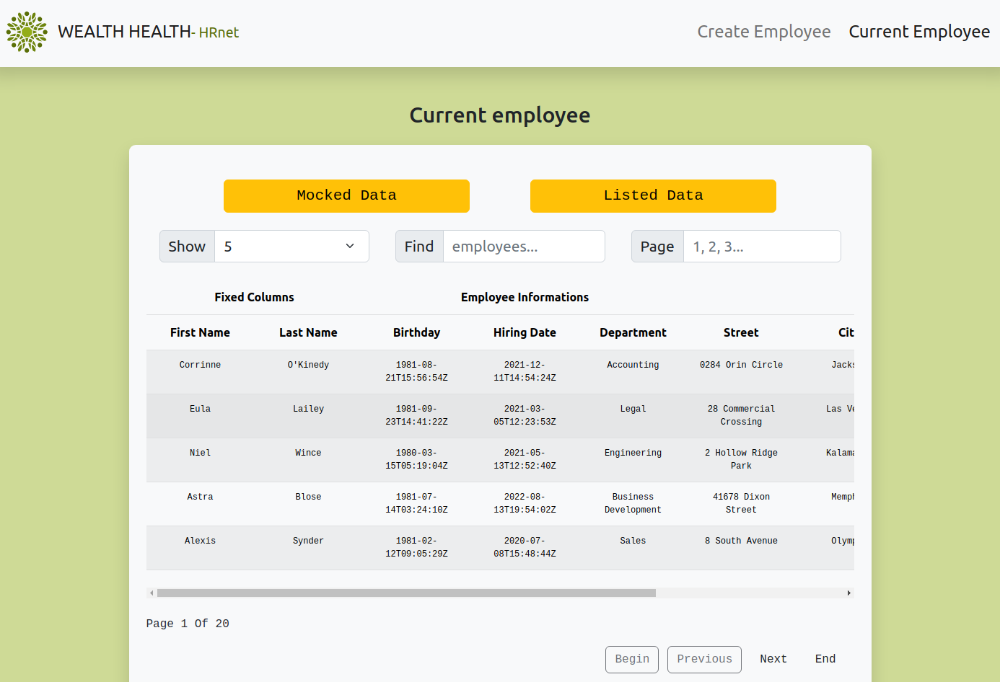

# Wealth-Health

Convert a **jQuery library to React**

**HRnet** is a human ressource Sass of the **Wealth Health** company.


Visit the **jQuery** UI on [**NETLIFY**](https://chic-bavarois-ad5df3.netlify.app)

Visit the **REACT** UI on [**NETLIFY**](https://courageous-swan-58d1c8.netlify.app)


# Convert [HRNet jQuery app] to a React application

## 🔖 app issues

✅ **Create Employee** React page

✅ **Employee List** React page

✅ Add a **state management** system

✅ Complete with a consistent **style**

✅ Only manual **tests** are needed

## 🔖 jQuery plugins issues :

- [jQuery **Date Selector Plugin**](https://github.com/OpenClassrooms-Student-Center/P12_Front-end/issues/1)
- [jQuery **Drop down menus**](https://github.com/OpenClassrooms-Student-Center/P12_Front-end/issues/4)
- [jQuery **Plugin for data table selection**](https://github.com/OpenClassrooms-Student-Center/P12_Front-end/issues/2)
- [jQuery **Modal window plugin**](https://github.com/OpenClassrooms-Student-Center/P12_Front-end/issues/3)

## 🔖 You will transform a **jQuery plugin** of the site **into React** :

- [react-table + react-table-sticky](https://www.npmjs.com/package/react-table) : React Table v7
- [react-datepicker](https://react-bootstrap.github.io/forms/overview/) : A simple react-bootstrap date picker component
- [react-select](https://react-bootstrap.github.io/forms/overview/) : A simple react-bootstrap select dropdown component

✅ [**NPM PACKAGE - Modal**](https://www.npmjs.com/package/modal-celestin?activeTab=readme) : Modal Project 14

---

## 🔭 Clone project

```bash
git clone https://github.com/AxSF3/Projet-14
```

---

## ☄️ Front-End launching

```bash
npm i && npm start
```

🔌 then opens your browser on the port [localhost:3000](http://localhost:3000)

---

- REACT-BOOTSTRAP UI **HOMEPAGE**
  

- REACT-BOOTSTRAP UI **CREATE EMPLOYEE FORM**
  

- REACT-BOOTSTRAP UI **TABLE LIST EMPLOYEES**
  

- NPM PACKAGE UI **ALERT BOX**
  
